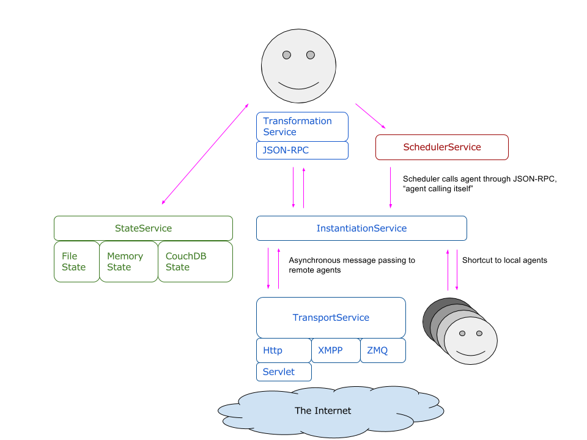

# Capabilities

Eve implements agents as a collection of capabilities. Please refer to the [Agent section](/implementations/java/agents.html) for an overview how these capabilities can form agents. 

This section provides an overview of the available capabilities, and their purpose:

- [Capability](#Capabilities): This part describes the generic capability model as implemented by all other capabilities
- [Transports](#TransportCapabilities): Providing an asynchronous, string-based communication capability
- [Transforms](#TransformCapabilities): Providing message transformation and call handling capability
- [States](#StateCapabilities):			 Providing persistent state storage, in the form of a key-value store
- [Scheduling](#SchedulerCapabilities): Providing the ability to receive calls at scheduled future moments
- [Lifecycle](#LifecycleCapabilities): Provide capabilities for booting and suspending agents

See image below for the highlevel interaction between the capabilities.

## Capability model {#Capabilities}

All capabilities follow the same usage pattern, implementing the same interface. Obtaining an specific instance of a capability is done through a builder pattern. This is a three step process:

1. Create a configuration for the capability
2. Define a callback method for the capability
3. Build a capabilityBuilder with the configuration and the callback

### Configuration format

All capabilities accept a Jackson JSON DOM node as configuration.This allows very flexible configuration and allows the agent to serialize its configuration. It also allows the configuration to be obtained from file in various file formats (JSON, Yaml, etc.) For most capabilities there is a one-on-one mapping from JSON config to specific capability instance. This means if you build a capability with exactly the same configuration, you most probably get the same capability instance again.

For most capabilities there is a specific config class, extending Jackson's JsonNode, which you can use to programatically set the various configuration fields. (=bean-like interface)

### Callback method

Several capabilities need to be able to invoke a callback method on the agent. For example, an incoming message needs to be able to invoke a receive method in the agent. The capability model provides the possibility to provide such a callback method to the capability. This callback is wrapped in a handler object, to allow the agent to be suspended. (see [lifecycle](#LifecycleCapabilities) for more information about suspension) Depending on the capability category, the callback method needs to implement a specific interface. (e.g. Receiver for Transports) 

### Capability builder

All capabilities have their own builder. This allows compile-time selection of the capability. But for full data driven setups, in which it's not yet known which capability will be used during runtime, it is possible to use the generic CapabilityBuilder. This builder uses a "class" field in the configuration to dynamically select the needed capability.

## Transport capabilities {#TransportCapabilities}

Eve agents can communicate via various transports. Eve currently has four built-in transport protocol implementations: Http, Websockets, Xmpp and ZeroMQ.

- [Http transport](#HttpTransport) allows agents to contact each other through a HTTP client.
  Agents can be invoked by sending a HTTP POST request via a regular Java servlet.
- [Websocket transport](#WSTransport) allows agents to contact one specific other agent through a websocket connection. One agent uses the server side transport, the other the client side. 
- [Xmpp transport](#XmppTransport) allows to connect agents to an XMPP server. The agents can then send messages to each other through XMPP.
- [Zmq transport](#ZmqTransport) allows agents to contact each other through ZMQ PUSH/PULL sockets.

A single Eve agent can have multiple Transports configured, each with its own URL structure.
This allows exposure of the agents via multiple transports at the same time. This also means each agent has multiple addresses as well.

#### Global transport configuration

All transport capabilities share two configuration items:

**doShortcut**: This option controls if the capability may bypass the network layer if it detects that the receiver of a message is actually hosted in the same VM. If this options is true, the message may be passed directly to the receiver, if false, the message is fully send through the network layer, included potential serializations, etc.

**doAuthentication**: This option controls if the transport capability is responsible for fully determine the authentication of the remote endpoint on incoming messages. If true, the capability will enforce access authentication. (Within the HTTP transport this enforces SSL and basic authentication) If false, the capability will just accept the remote endpoints claimed senderUrl and use that as sender address.

### Http transport {#HttpTransport}

The agent needs to initialise the HttpCapability through the HttpTransportBuilder. This capability acts like an adapter to a servlet which implements the HTTP endpoint. This servlet needs to be setup separately from the HttpCapability, although in the embedded setup this is done in one configuration action.

Eve comes with a servlet *EveServlet* which exposes agents via a standard Java servlet. A specific agent can be addressed via this servlet by specifying
its id in the servlet url in a RESTFull manner: &lt;baseUrl&gt;/&lt;id&gt;, e.g. "http://example.com/agents/myAgentId".

#### Configuration

There are two ways to setup the servlet environment:

- Through an embedded Jetty setup, configured through the normal CapabilityConfig
- Configuration through web.xml, besides the normal CapabilityConfig

##### Generic configuration


#Setup the configuration:
final HttpTransportConfig config = new HttpTransportConfig();
config.setServletUrl("http://localhost:8080/agents/");
config.setId("testAgent");

#Build the transport:
final Transport transport = new TransportBuilder()
	.withConfig(config)
	.withHandle(new myReceiver())
	.build();


##### Servlet configuration with embedded Jetty

This configuration is very similar to the above setup, except that some more configuration is added to configure the servlet. This setup requires that the embedded Jetty is bundled


#Setup the configuration:
final HttpTransportConfig config = new HttpTransportConfig();
config.setServletUrl("http://localhost:8080/agents/");
config.setId("testAgent");
	
#Add a servlet launcher to the http config:
config.setServletLauncher("JettyLauncher");

#Add Jetty specific configuration to the http config:
final ObjectNode jettyParms = JOM.createObjectNode();
jettyParms.put("port", 8080);
config.put("jetty", jettyParms);

#Build the transport:
final Transport transport = new TransportBuilder()
	.withConfig(config)
	.withHandle(new myReceiver())
	.build();


The equivalent Json configuration is:

{
	"class":"com.almende.eve.transport.http.HttpTransportBuilder",
	"servletUrl":"http://localhost:8080/agents/",
	"id":"testAgent",
	"servletLauncher":"JettyLauncher",
	"doShortcut":true,
	"doAuthentication":true,
	"jetty":{
		"port":8080,
	}
}


##### Servlet configuration through Web.xml

When running Eve in an external servlet environment like in Jetty or Tomcat, the servlet needs to be configured in the web.xml:

To configure the servlet add the following lines to the **web.xml** file of the Java project,
inside the &lt;web-app&gt; tag:


<servlet>
	<servlet-name>war</servlet-name>
	<servlet-class>com.almende.eve.transport.http.EveServlet</servlet-class>
	<init-param>
		<param-name>ServletUrl</param-name>
		<param-value>http://localhost:8080/war/agents/</param-value>
	</init-param>
	<load-on-startup>1</load-on-startup>
</servlet>

<servlet-mapping>
	<servlet-name>war</servlet-name>
	<url-pattern>/agents/*</url-pattern>
</servlet-mapping>


The *url-pattern* in the servlet mapping can be freely chosen (in the example
chosen as `/agents/*`). This determines the url at which the servlet is running.
It is important to end the url with the pattern /\*,
as the url of the servlet will end with the id of the agent. Together with the hostname of the server, this url-pattern forms the servlet base URL, which needs to be provided to the servlet, through the ServletUrl init parameter. This parameter is used by the servlet to lookup the HttpTransportCapabilities of the configured agents.
It is therefor important that the ServletUrl parameter is equal to the ServletUrl parameter in the HttpTransportConfig instance that is given to the HttpTransportBuilder.

#### Debug servlet

Besides the EveServlet, there is also a debug servlet available, which exposes a simpel debugging GUI when GET-ing the agent url. This debug servlet is implemented in class: com.almende.eve.transport.http.DebugServlet. Just replace EveServlet with DebugServlet in the above mentioned configuration.

### Websocket transport {#WSTransport}

The websocket transport is somewhat different from the other transports, in the sense that it can only be used to exchange data with a specific other agent. It is not a generic routing transport, like XMPP or HTTP, but limits traffic to a single remote agent. 

To use websockets, the two agents need to implement a side of the client-server relationship. After initialisation, this directional choice doesn't further limit traffic.

#### Client side



final WebsocketTransportConfig serverConfig = new WebsocketTransportConfig();
clientConfig.setId("testClient");
clientConfig.setServerUrl("ws://localhost:8082/ws/testServer");

/* default value, this can be omitted */
clientConfig.setServer(false);

final Transport client = new TransportBuilder()
	.withConfig(clientConfig)
	.withHandle(new MyReceiver())
	.build();
client.connect();

client.send(URI.create("ws://localhost:8082/ws/testServer"),
				"Good day to you!", null);


As stated, the client connection only supports sending data to the server endpoint, as shown in the above example.

The equivalent Json configuration is:

{
	"class":"com.almende.eve.transport.ws.WebsocketTransportBuilder",
	"server":false,
	"id": "testClient",
	"serverUrl": "ws://localhost:8082/ws/testServer"	
}


#### Server side



final WebsocketTransportConfig serverConfig = new WebsocketTransportConfig();
serverConfig.setAddress("ws://localhost:8082/ws/testServer");
serverConfig.setServer(true);

serverConfig.setServletLauncher("JettyLauncher");
final ObjectNode jettyParms = JOM.createObjectNode();
jettyParms.put("port", 8082);
serverConfig.put("jetty", jettyParms);
		
final Transport server = new TransportBuilder()
	.withConfig(serverConfig)
	.withHandle(new MyReceiver())
	.build();
		
server.send(URI.create("wsclient:testClient"), "Hi there!", null);


As shown, the connected clients are addressable through "wsclient:&lt;clientId&gt;". 

The equivalent Json configuration is:

{
	"class":"com.almende.eve.transport.ws.WebsocketTransportBuilder",
	"server":true,
	"address":"ws://localhost:8082/ws/testServer",
	"servletLauncher":"JettyLauncher",
	"jetty":{
		"port":8082
	}
}


### Xmpp transport {#XmppTransport}

Agents can be connected individually to an XMPP server through the Xmpp transport capability. Each agent can be addressed through the given JabberID. (e.g. xmpp:agent@example.com/endpoint)

#### Configuration


final XmppTransportConfig params = new XmppTransportConfig();
params.setAddress("xmpp://alice@example.com/example");
params.setPassword("wonderland");
		
final Transport transport =	new XmppTransportBuilder()
	.withConfig(params)
	.withHandle(new MyReceiver()).build();

#Connect to the server
transport.connect();
		
#Send some data to the other end
transport.send(URI.create("xmpp:bob@example.com"),"Hello World", null);
	

#Disconnect again if required
transport.disconnect();



The equivalent Json configuration is:

{
	"class":"com.almende.eve.transport.xmpp.XmppTransportBuilder",
	"address":"xmpp://alice@example.com/example",
	"password":"wonderland",
	"doShortcut":true,
	"doAuthentication":true
}


### Zmq transport {#ZmqTransport}

Linux 64-bit only! 
As it stands, the current implementation of ZMQ sockets in Eve depends Maven artifacts only available for Linux 64-bit architectures.

Agents can also be provided with ZeroMQ sockets. Eve supports all three types of ZeroMQ addresses: TCP sockets, IPC sockets and inproc sockets. When the agentHost is configured for ZeroMQ, each agent is provided with an inbound PULL socket at the configured address. Each outbound call will instantiate a PUSH socket which pairs with the remote PULL socket.

#### Configuration


#Setup configuration:
final ZmqTransportConfig config = new ZmqTransportConfig();
config.setAddress("zmq://tcp://127.0.0.1:5678");
	
#Build transport
final Transport transport = new TransportBuilder()
	.withConfig(config)
	.withHandle(new MyReceiver())
	.build();

#Setup listening sockets:
transport.connect();
		
#Send some data to the other end
transport.send(URI.create("zmq://tcp://127.0.0.1:5678"), "Hello World",
	null);


The equivalent Json configuration is:

{
	"class":"com.almende.eve.transport.zmq.ZmqTransportBuilder",
	"address":"zmq://tcp://127.0.0.1:5678",
	"doShortcut":true,
	"doAuthentication":true
}


With the above mentioned configuration each agent will get a ZMQ socket assigned with the following address: tcp://127.0.0.1:5678.
The ZMQ transport supports all three ZMQ address types:

- A TCP address of form:  **tcp://{address}:{basePort+agentOffset}** (e.g.  tcp://127.0.0.1:5447 for the third agent in the system, is the baseport is 5444)
- A local socket in the form of: **ipc:///tmp/zmq-socket-{agentId}**
- A inproc socket in the form of: **inproc://{agentId}**

For routing to these addresses from within an agent a zmq: prefix needs to be added (as reported through agent.getUrls()). (e.g. zmq:ipc:///tmp/zmq-socket-testAgent1)

## Transform Capabilities {#TransformCapabilities}

In the agent implementations, described in the [Agent section](/implementations/java/agents.html), the message transformations are normally hidden behind a simplified API. These transformations are implemented as capability. Currently only the RPC handling is available as transformation, but in the near future other protocol conversions will be provided. This can include things like compression, encryption, specialized envelops, etc.

### RPC Transform Capability


final RpcTransformConfig config = new RpcTransformConfig();
config.setCallbackTimeout(20);

final RpcTransform transform = new RpcTransformBuilder()
	.withConfig(config)
	.withHandle(
		new SimpleHandler<Object>(new MyClass()))
	.build();
		
final AsyncCallback<Boolean> callback = new AsyncCallback<Boolean>() {
		
	@Override
	public void onSuccess(final Boolean result) {
		LOG.warning("Success!");
		assertTrue(result);
	}
	
	@Override
	public void onFailure(final Exception exception) {
		LOG.log(Level.WARNING, "Fail:", exception);
		fail();
	}
};
		
final ObjectNode parms = JOM.createObjectNode();
parms.put("parm", true);

#Outbound traffic:
final Object request = transform.buildMsg("testMe", parms, callback);
		
#Inbound traffic:
final Object response = transform.invoke(request,senderUrl);


For outbound traffic the RPC transform is used to create the RPC request. The RPC transform also keeps state for these request, if a callback method is provided. This callback will be kept in memory for a configurable timeout period. (default is 30 seconds)

For inbound traffic, the RPC transform 'invoke' method will first determine if this is a reply on an earlier outbound request. If it is, it will obtain the callback and call it's methods. If this is an inbound request, the RPC transform will prepare and invoke a method call on the object that is given as handler to the builder.

## State Capabilities {#StateCapabilities}

Through the State abstraction, agents are offered the capability for easy storage of data per agent. Currently the State is modeled as a simple key/value store. Various implementations are offered, with different storage attributes:

- In-memory state
- JSON based file state
- Java object serialization file state
- CouchDB state
- MongoDB state

### Usage

State acts similar to a Java collections Map&lt;String,Object&gt;, but with a few distinct differences. The biggest difference if that the state can be serialized to JSON (for persistency) which potentially loses type information on the value. This means that the methods for getting the value need to reinject this type information. 

There is a normal put(key,value) method for placing data in the state, overwriting potential existing values. Similarly there are normal remove(key) and containsKey(key) methods. However, other methods are not provided, most notably entrySet() and values().

As mentioned, the getter methods need to reinject the missing type information, as can be seen in the get(key, type) methods:


<T> T get(String key, JavaType type);
<T> T get(String key, TypeUtil<T> type);
<T> T get(TypedKey<T> key);
<T> T get(String key, Class<T> type);
<T> T get(String key, Type type);


These 5 methods each given a different way for putting type information back into the object. These methods actually reflect the same set of options that the JSON-RPC library also offers on it's send() methods. For JSON based State storage (FileState, CouchDB state, etc.) the first three are more efficient than the latter two. This is because in those cases Jackson doesn't need to reflect on the Java classes themselves, which is a relative slow operation.

#### Optimistic locking

Eve agents can use various approaches to scalability, including running multiple threads for the same agent concurrently. The agent's state must therefor act as a synchronization point for these threads. Within Java there are various strategies you can take to handle concurrent State access. But especially if certain agent threads run in a different VM/Server (e.g. loadbalanced HTTP setup) it becomes problematic to use standard Java synchronization tools. 
For this problem, the state offers some distinct tooling for concurrency handling, based on optimistic locking. This is based on the atomic putIfUnchanged() method:


boolean putIfUnchanged(String key, Object newVal, Object oldVal);


This method is normally used in the following manner:


public void incr(key){
	int oldval = myState.get(key, Integer.class);
	int newval = oldval + 1;
	if (!myState.putIfUnchanged(key, newval, oldval)){
		//recursive retry:
		incr(key);
	}
}


Basically you get the current value, make a copy which you modify. Next step you store the value again, but with a check that no other thread has just modified the same value, in which case you just retry the operation.

For each type of State, you'll find a small code sample below:

#### Memory State


final MemoryStateConfig params = new MemoryStateConfig();
params.setId("TestAgent");
		
State myState = new StateBuilder()
	.withConfig(params)
	.build();

myState.put("msg", "Hi There!");
String result = myState.get("msg", String.class);


#### JSON based file State


final FileStateConfig params = new FileStateConfig();
params.setId("TestAgent");

/* Some defaults: */
params.setJson(true); 
params.setPath(".eveagents");
	
State myState = new StateBuilder()
	.withConfig(params)
	.build();

myState.put("msg", "Hi There!");
String result = myState.get("msg", String.class);


#### Serialized data file State


final FileStateConfig params = new FileStateConfig();
params.setId("TestAgent");
params.setJson(false);

/* default value, therefor optional: */
params.setPath(".eveagents");
	
State myState = new StateBuilder()
	.withConfig(params)
	.build();

myState.put("msg", "Hi There!");
String result = myState.get("msg", String.class);


#### CouchDB State


final CouchStateConfig params = new CouchStateConfig();
params.setId("TestAgent");
params.setUrl("http://localhost:5984");
params.setUsername("myCouchDBUser");
params.setPassword("myCouchDBPassword");

/* default value, therefor optional: */
params.setDatabase("eve");
	
State myState = new StateBuilder()
	.withConfig(params)
	.build();

myState.put("msg", "Hi There!");
String result = myState.get("msg", String.class);


#### MongoDB State


final MongoStateConfig params = new MongoStateConfig();
params.setId("TestAgent");

/* default values, therefor optional: */
params.setHost("localhost");
params.setPort(27017);
params.setDatabase("eve");
params.setCollection("agents");
	
State myState = new StateBuilder()
	.withConfig(params)
	.build();

myState.put("msg", "Hi There!");
String result = myState.get("msg", String.class);



## Scheduling Capabilities {#SchedulerCapabilities}

To facilitate the autonomous behavior of the software agents, Eve offers various scheduling capabilities. These capabilities act like trigger generators, offering delayed, interval driven message delivery. These messages can contain RPC, allowing the scheduler to be used as an asynchronous taskrunner as well.

- Simple Scheduler Capability - A basic scheduler that keeps the tasks in a memory queue
- Persistent Scheduler Capability - A scheduler that uses a State (see above) for storing the task queue, allowing among others filebased persistency.

### Usage

#### Simple Scheduler


final SimpleSchedulerConfig params = new SimpleSchedulerConfig();
params.setSenderUrl("local:scheduler");
		
final Scheduler test = new SchedulerBuilder()
	.withConfig(params)
	.withHandle(new SimpleHandler<Receiver>(new MyReceiver()))
	.build();
	
test.schedule("Hi there!", DateTime.now());
test.schedule("Hi there!", DateTime.now().plusSeconds(10));


The equivalent Json configuration is:

{
	"class":"com.almende.eve.scheduling.PersistentSchedulerBuilder",
	"senderUrl":"local:scheduler",
}


#### Persistent Scheduler

The biggest difference between the SimpleScheduler and the PersistentScheduler is the addition of a State for storing the task queue of the scheduler. 


final PersistentSchedulerConfig params = new PersistentSchedulerConfig();
final FileStateConfig state = new FileStateConfig();
state.put("class", FileStateBuilder.class.getName());
state.put("path", ".eveagents_schedulingtest");
state.put("id", "testScheduling");
		
params.setState(state);
params.setSenderUrl("local:scheduler");
		
final Scheduler test = new SchedulerBuilder()
	.withConfig(params)
	.withHandle(new SimpleHandler<Receiver>(new MyReceiver()))
	.build();
		
test.schedule("Hi there!", DateTime.now());
test.schedule("Hi there!", DateTime.now().plusSeconds(10));


The equivalent Json configuration is:

{
	"class":"com.almende.eve.scheduling.PersistentSchedulerBuilder",
	"senderUrl":"local:scheduler",
	"state":{
		"class":"com.almende.eve.state.FileStateBuilder",
		"path":".eveagents_schedulingtest",
		"json":true,
		"id":"testScheduling"
	}
}


