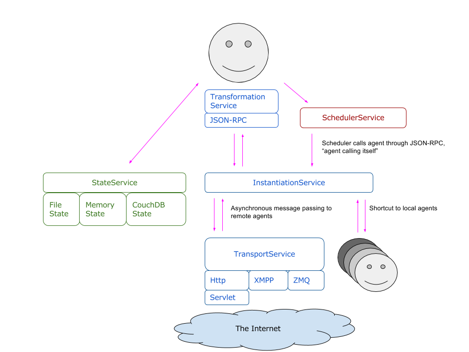

# Services

The Java version of Eve is designed around an AgentHost, which provides the agents with various services:

- [Transport Services](#TransportService): Providing asynchronous, String-based communication services to the agents.
- [State Services](#StateService): Providing persistent state storage, in the form of a key-value store.
- [Scheduler Services](#SchedulerService): Providing the ability to receive RPC calls at scheduled future moments.
- Callback Services: A utility service for in-memory storage of callback structures.

In the near future two current agent functions will also be migrated to services: Message transformation and Agent instantiation.

See image below for the highlevel interaction between the services.

## TransportService {#TransportService}

Eve agents can communicate via various transport services.
Eve currently has three built-in transport services: HttpService, XmppService and ZeroMQService.

- [HttpService](#HttpService) allows agents to contact each other through a HTTP client.
  Agents can be invoked by sending a HTTP POST request via a regular Java servlet.
- [XmppService](#XmppService) allows to connect agents to an XMPP server.
  The agents can be invoked via XMPP.
- [ZmqService](#ZmqService) allows agents to contact each other through ZMQ PUSH/PULL sockets.

A single Eve application can have multiple TransportServices configured, each with its own URL structure.
This allows exposure of the agents via multiple transport services at the same time. This also means each agent has multiple addresses as well.

### HttpService {#HttpService}

Eve comes with a servlet *AgentServlet* which exposes agents via a standard
Java servlet. A specific agent can be addressed via this servlet by specifying
its id in the servlet url.

To use the AgentServlet, the servlet must be configured in the web.xml file
of the Java project, and a context listener must be configured to start an
Eve AgentHost.

#### Configuration

##### Servlet configuration

When running Eve in a servlet environment like in Jetty or Tomcat, two
things needs to be configured:

- **AgentListener**
  A servlet context listener needs to be set up to load a singleton
  AgentHost on startup of the web application.
  This AgentHost manages all agents.
- **AgentServlet**
  At least one servlet needs to be set up to route incoming requests for agents.
  One can use the provided `AgentServlet` for this, or build something customized.
  An AgentServlet will automatically create an HttpService with its configured
  servlet url, and register this transport service to the AgentHost.
  It is possible to configure multiple Agent servlets, and they will all share
  the same AgentHost.

To configure the servlet and context listener,
add the following lines to the **web.xml** file of the Java project,
inside the &lt;web-app&gt; tag:


<context-param>
	<description>eve configuration (yaml file)</description>
	<param-name>eve_config</param-name>
	<param-value>eve.yaml</param-value>
</context-param>
<context-param>
	<param-name>eve_authentication</param-name>
	<param-value>false</param-value>
</context-param>
<listener>
	<listener-class>com.almende.eve.transport.http.AgentListener</listener-class>
</listener>

<servlet>
	<servlet-name>AgentServlet</servlet-name>
		<servlet-class>com.almende.eve.transport.http.AgentServlet</servlet-class>
		<init-param>
			<param-name>environment.Development.servlet_url</param-name>
			<param-value>http://localhost:8888/agents/</param-value>
		</init-param>
		<init-param>
			<param-name>environment.Production.servlet_url</param-name>
			<param-value>http://myeveproject.appspot.com/agents/</param-value>
		</init-param>
	</servlet>
	<servlet-mapping>
		<servlet-name>AgentServlet</servlet-name>
		<url-pattern>/agents/*</url-pattern>
	</servlet-mapping>


The *url-pattern* in the servlet mapping can be freely chosen (in the example
chosen as `/agents/*`).
This determines the url at which the servlet is running.
It is important to end the url with the pattern /\*,
as the url of the servlet will end with the id of the agent.

The AgentListener supports the following context parameters:

<table>
    <tr>
        <th>Name</th>
        <th>Description</th>
    </tr>
    <tr>
        <td>eve_config</td>
        <td>
            The context-param <code>eve_config</code> points to an eve configuration file
            (for example eve.yaml). The configuration file is used by the AgentHost
            and contains configuration for the state, scheduler, and services.
            The configuration of the AgentHost is described on the page
            <a href="configuration.html">Configuration</a>.
        </td>
    </tr>
    <tr>
        <td>eve_authentication</td>
        <td>
            The parameter <code>eve_authentication</code> is a boolean and is
            <code>true</code> by default. When authentication is enabled,
            Eve uses SSL authentication to communicate between agents.
        </td>
    </tr>
</table>

The AgentServlet configuration can contain the following init parameters:

<table>
    <tr>
        <th>Name</th>
        <th>Description</th>
    </tr>
    <tr>
        <td>servlet_url</td>
        <td>
        The url of the servlet.
        This url is needed in order to be able to built an agents url.
        The url of an agent is built up by the servlet url and its id.
        For example, when servlet_url is
        <code>http://myserver.com/agents</code>,
        and the agent has id <code>100</code>, the agents url will be
        <code>http://myserver.com/agents/100/</code>.
        </td>
    </tr>
    <tr>
        <td>environment.Development.servlet_url</td>
        <td>
        The url of the servlet while running in development mode.
        This url will override *servlet_url* if specified.
        </td>
    </tr>
    <tr>
        <td>environment.Production.servlet_url</td>
        <td>
        The url of the servlet while running in production mode.
        This url will override *servlet_url* if specified.
        </td>
    </tr>

</table>

#### Usage

The AgentServlet supports the following request:

- `GET /agents/`

  Returns information on how to use this servlet.

- `GET /agents/{agentId}`

  Returns an agents web interface, allowing easy interaction with the agent.
  A 404 error will be returned when the agent does not exist.

- `POST /agents/{agentId}`

  Send an RPC call to an agent.
  The body of the request must contain a JSON-RPC request.
  The addressed agent will execute the request and return a
  JSON-RPC response. This response can contain the result or
  an exception.
  A 404 error will be returned when the agent does not exist.

- `PUT /agents/{agentId}?type={agentType}`

  Create an agent. `agentId` can be any string. `agentType` must
  be a full java class path of an Agent. A 500 error will be
  thrown when an agent with this id already exists.

- `DELETE /agents/{agentId}`

  Delete an agent by its id.

#### Custom servlets

If the AgentServlet do not fulfill your needs,
it is possible to develop a custom servlet.
This can for example be useful when exposing an existing service via a JSON-RPC
interface to the Eve world.
When creating a custom servlet, it is possible to get a better performance,
as the servlet can be integrated tightly with the service.
It is not necessary to have a real Eve agent running via the servlet,
the essence is that a service exposes a JSON-RPC interface to the outside world.

### XmppService {#XmppService}

Agents can be connected individually to an XMPP server.
In order to support XMPP, the application requires the
[Smack XMPP libraries](http://www.igniterealtime.org/projects/smack/)
*smack.jar* and *smackx.jar* to be included in the projects build path.

Note that XmppService is not supported on Google App Engine, as it requires
continuous connections to an XMPP server from one application instance,
while Google App Engine is based on stateless application instances which can
be started and stopped any moment.

#### Configuration

XMPP support must be configured in the Eve configuration file with default
file name **eve.yaml**.


# communication services
transport_services:
- class: XmppService
  host: my_xmpp_server.com
  port: 5222
  service: my_xmpp_service_name



#### Usage

An agent can be connected to an XMPP service programmatically via the configured
XmppService. The following code example shows how an agent can retrieve the
xmpp service via its AgentHost,
and connect itself to the service with a username and password.


@Access(AccessType.PUBLIC)
public void xmppConnect(@Name("username") String username,
	@Name("password") String password) throws Exception {
	AgentHost host = getAgentHost();
	XmppService service = (XmppService) host.getService("xmpp");
	if (service != null) {
		service.connect(getId(), username, password);
	} else {
		throw new Exception("No XMPP service registered");
	}
}

@Access(AccessType.PUBLIC)
public void xmppDisconnect() throws Exception {
	AgentHost host = getAgentHost();
	XmppService service = (XmppService) host.getService("xmpp");
	if (service != null) {
		service.disconnect(getId());
	} else {
		throw new Exception("No XMPP service registered");
	}
}


### ZmqService {#ZmqService}

Agents can also be provided with ZeroMQ sockets. Eve supports all three types of ZeroMQ addresses: TCP sockets, IPC sockets and inproc sockets. When the agentHost is configured for ZeroMQ, each agent is provided with an inbound PULL socket at the configured address. Each outbound call will instantiate a PUSH socket which pairs with the remote PULL socket.

#### Configuration

ZeroMQ support must be configured in the Eve configuration file with default
file name **eve.yaml**.


# communication services
transport_services:
- class: ZmqService
  baseUrl: tcp://127.0.0.1:5444
- class: ZmqService
  baseUrl: ipc:///tmp/zmq-socket-
- class: ZmqService
  baseUrl: inproc://



With the above mentioned configuration each agent will get three different ZMQ sockets assigned with the following addresses:

- A TCP address of form:  **tcp://{address}:{basePort+agentOffset}** (e.g.  tcp://127.0.0.1:5447 for the third agent in the system)
- A local socket in the form of: **ipc:///tmp/zmq-socket-{agentId}**
- A inproc socket in the form of: **inproc://{agentId}**

For routing to these addresses from within an agent a zmq: prefix needs to be added (as reported through agent.getUrls()). (e.g. zmq:ipc:///tmp/zmq-socket-testAgent1)

## State Service {#StateService}

Currently Eve offers the choice between four different state storage services, of which only one can be active for a given VM at the same time.The available state services are:

- In-memory state
- JSON based file state
- Java object serialization file state
- CouchDB state

Within the codebase of Eve these State services are provided through a configured StateFactory.

### Configuration

To configure the state factory one of the below shown configurations can be used in **eve.yaml**. You\'ll need to modify the parameters somewhat to match your local settings, especially in the CouchDB case. As mentioned: only one state factory can be used per application!



# State settings: Choose only one!
# memory state:
state:
  class: MemoryStateFactory

# Java serialization file state:
state:
  class: FileStateFactory
  path: .eveagents

# JSON based file state:
state:
  class: FileStateFactory
  path: .eveagents
  json: true

# CouchDB state:
state:
  class: CouchdbStateFactory
  url: http://localhost:5984
  database: eve
  username: eve_user
  password: eve_passwd



### Usage

Each agent can reach it\'s State through the getState() method (in the Agent.java superclass). State acts similar to a Java collections Map&lt;String,Object&gt;, but with a few distinct differences. The biggest difference if that the state can be serialized to JSON (for persistency) which potentially loses type information on the value. This means that the methods for getting the value need to reinject this type information. 

There is a normal put(key,value) method for placing data in the state, overwriting potential existing values. Similarly there are normal remove(key) and containsKey(key) methods. However, other methods are not provided, most notably entrySet() and values().

As mentioned, the getter methods need to reinject the missing type information, as can be seen in the get(key, type) methods:



<T> T get(String key, Class<T> type);
<T> T get(String key, Type type);
<T> T get(String key, JavaType type);
<T> T get(String key, TypeUtil<T> type);
<T> T get(TypedKey<T> key);



These 5 methods each given a different way for putting type information back into the object. These methods actually reflect the same set of options that the JSON-RPC library also offers on it's send() methods. 

#### Optimistic locking

Eve agents normally have a thread per method call, which means that state operations need to be coordinated. Because its not guaranteed that each thread operates on the same agent object instance, it is not possible to use normal java synchronisation tooling.(and we would not advice workarounds to get to that behaviour) However, the state offers some distinct tooling for concurrency handling, based on optimistic locking. This is based on the atomic putIfUnchanged() method:



boolean putIfUnchanged(String key, Object newVal, Object oldVal);



This method is normally used in the following manner:



public void incr(key){

	int oldval = getState().get(key, Integer.class);
	int newval = oldval + 1;
	if (!getState().putIfUnchanged(key, newval, oldval)){
		//recursive retry:
		incr(key);
	}
}



Basically you get the current value, make a copy which you modify. Next step you store the value again, but with a check that no other thread has just modified the same value, in which case you just retry the operation.

## Scheduler Services {#SchedulerService}

To facilitate the autonomous behavior of the software agents, Eve offers each agent a scheduler service. The scheduler can call agent methods after a given delay, possibly repetitive. Currently there are two scheduler services available:

- RunnableSchedulerFactory  - A basic scheduler that keeps a list of all scheduled tasks for all agents in the system. Offers a pretty precise scheduling (&lt;10ms delays) but is not very scalable, it\'s performance degrades significantly at around 100 tasks per second.
- ClockSchedulerFactory  - A more scalable design, which stores the tasks in the agents state. Because the data is now distributed among the agents, it is more scalable, but at a latency price. Currently this scheduler has delays in the 80-100ms range for normal tasks, but doesn\'t degrade at scale.

### Configuration


# Use one of the two options below:

# scheduler settings
scheduler:
  class: RunnableSchedulerFactory
  id: _runnableScheduler

scheduler:
  class: ClockSchedulerFactory



The \"id\" option of the RunnableSchedulerFactory depicts the agentname the scheduler will use. This shown name \"_runnableScheduler\" is the default, which will be used if the option is omitted.

### Usage

Each agent is offered a getScheduler() method. (through the Agent.java superclass). The scheduler object that is returned has a createTask() method that does the actual scheduling:



	String createTask(JSONRequest request, long delay);
	String createTask(JSONRequest request, long delay, boolean repeat, boolean sequential);



The former is uses the latter, with both optional parameters at their default false. The parameters have the following effect:

- JSONRequest request  - The method (with it\'s parameters) which needs to be called at the scheduled moment. This needs to be accessible through JSON-RPC at a minimal accessType of AccessType.SELF. (AccessType.UNAVAILABLE (which is the default) is not callable from the scheduler)
- long delay  - The schedule delay in milliseconds from now. 
- boolean repeat  - Should the task be repeated multiple times, at *delay* intervals?
- boolean sequential - When repeating the task, may multiple instances run in parallel? When given the *true* value, the next schedule round waits until the earlier execution has finished before scheduling the next execution. (at delay interval after the finish) If this parameter has a value of *false* the next iteration will be scheduled directly from the start of the current round, allowing the next to run in parallel if the execution takes longer than the delay.

