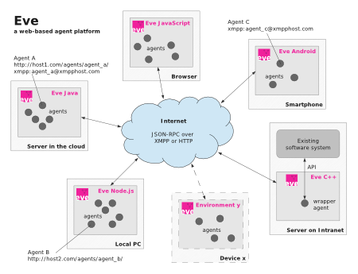

# Introduction

Eve is a multipurpose, web based agent platform. 
The project aims to develop an open protocol for communication between software agents. 
Eve is designed as a decentral, scalable system for autonomously acting agents.
Eve uses the existing world wide web as platform, 
and uses existing protocols for data exchange (HTTP) and for messaging (JSON-RPC).

This page introduces the core concepts of Eve:

- [Web-based, decentral, and scalable](#scalable)
- [Simple communciation protocol](#protocol)
- [Multiplatform](#multiplatform)
- [Multipurpose](#multipurpose)
- [Modular](#modular)
- [Open source](#opensource)

## Web-based, decentral, and scalable {#scalable}

### Scalable

Eve uses a web-based communication protocol. 
This has a various advantages. Each agent has its own unique url on the web,
and can be located on any server. This makes the system scalable and allows
an unlimited number of agents in the system.
Thus, when scaling the system up, there is no complex installation or 
configuration required to add an extra server to the system. It is enough
to make the new server with agents available on the web, and get agents to know
the existens of these new agents. More about this in the next section.

Agents have a persisted state. In that case the url of the agent will not
only include the server where the agent resides, but also contain a 
unique identifier to address the correct agent. 
On the other hand, agents can also be stateless and just have one generic
url. This can be the case for agents offering generic web services such as
directions information.

### Shared services

One of the strengths of the web-based approach is its scalability. This approach 
leads to a decentral system, a system without one central coordination point.
The question arises how agents get to know each other. There is no central
list containing all agents available, which can be used to get in contact
with other agents.
The answer is shared services. This works quite similar to how people get to 
know each other: at work, in their street, at sports, when going out, and other 
occasions where people come together. 
With the software agents it works in the same way: agents can meet each other
via shared services. For example when different agents act in the same calendar,
or agents have registred themselves to a locations service where the locations
service is capable of returning all agents located in a certain neighborhood. 

Shared services are not predefined in Eve, but will be developed depending on 
the different application domains for which agents are developed.

There is one built-in solution via which it is possible to retrieve all agents
residing on one server, namely via the ManagerAgent which is always available.
This ManagerAgent is capable of creating, deleting, and listing agents on its 
own server.

### Asynchronous

Communication from an agent to another agent can be done in two ways: 
synchronously or asynchronously. It is strongly recommended to use asynchronous
communication, and develop agents in a stateless manner.

When making a regular (sychronous) call from agent A to agent B, agent A will 
block until it receives a response from agent B, and then move on with its tasks.
Now suppose that agent A has to contact a large set of agents and do something
with the responses. it is possible that these agents in turn need to 
retrieve information from other agent before sending a response. In the end,
this can lead to a large set of nested requests. This is very error phrone, and 
for example leads to timeout errors.

The recommened solution therefore is asynchronous communication between agents.
This communication similar to how humans interact: when person A requests 
something  from person B *"can you comment on this report for me?"*, 
person A doesn't wait until he gets a response. 
Instead he moves on with his tasks and, and after a while, he will get a 
response from person B with the requested comments.
Eve provides an asynchronous callback mechanism by which an agent can perform
a request, and the requested agent will schedule
the request and send the response back as soon as finished via a new callback 
request.

### Event driven

Because the HTTP protocol is used for communication, the agents are passive by nature.
The agents are event driven: they can only react to a request.
In order to let agents take the initiative to perform an action, actions need to be
scheduled. This can be done either from the outside, on server level, 
or by the agent itself.

The passiveness of the agents in Eve works quite different from most agent platforms.
In more traditional agent platorms, agents run actively as a thread on a
computer, and schedule their own actions via a delay.
With Eve however, agents are normally in a sleep modus, until they
get a request to handle. Actions are scheduled externally. 

Depending on the implementation, an agents state can be kept actively in 
the memory, or can be loaded and persisted with each request. 
The latter results in a so called "stateless protocol", and results in a highly 
scalable environment. This is the default approach for the Eve libraries so
far. 
However, when an agent is deployed as a dedicated web service with only 
one instance, it may not be applicable to store its state and just keep
the agent loaded in memory (possibly utilizing caching or other optimizations).

## Communication protocol {#protocol}

The communication of the agents is realized via existing protocols: the system
utilizes the existing world wide web as communications channel. 
Messages are sent via regular HTTP POST requests.
Each software agent has its own unique network url, and can be contacted by sending a 
JSON-RPC message to this url via a HTTP POST request.

JSON is a lightweight data-interchange format.
The protocol is easily readable and writable for humans, and easily parsable for machines. 
JSON libraries are available in most programming languages, but even without
a JSON library it is easy to read/write JSON data.

The simplicity of the communication protocol enables implementations of Eve
in all kind of different development platforms, also for platforms not yet 
supported with a ready made library.

## Development platforms {#multiplatform}

Agents can be built on any development platform (Java, CGI, C, PHP, .NET, NodeJS, ...), 
they just have to meet the protocol such that they can communicate with other 
agents over the internet. 
Eve dictates the communication protocol and the transfer protocol, 
but does not impose any restrictions on the development platform to be used.
In fact, Eve makes it very easy to interconnect systems developed on different
programming environments and running on different locations.
One can create an agent as a wrapper around existing systems and services, 
offering existing functionallity via the interface of this agent.

Currently there are two implementations of Eve: one in Java and one in Javascript.

### Java implementation

The Java implementation of Eve comes with a number of stand alone Java libraries 
which can be implemented in an existing Java project. 
The core library contains basic agent functionality and two easy to configure
web-servlets to host one or multiple agents. There is one abstract Agent class
from which new agent implementations can inherit.
There is currently one library available for persistency, which uses the 
Google DataStore. 
There are various libraries available with agents, acting on different domains
such as calendaring.

### Javascript implementation

The Javascript implementation uses NodeJS to run Javascript on the server side, 
and supports CouchDB for persistency.

The implementation offers a web service which handles the requests. During a
request the web service typically loads an agent by its id (provided in the url),
executes the required action, and persists and unloads the agent again. 
The NodeJS library of Eve provides an abstract Agent class, 
which can be used as base class from which new types of agents can be inherited
and created.

## Multipurpose {#multipurpose}

The Eve agent platform can be used for all kind of applications. 
New types of agents can be built to act on any type of domain.
Eve offers the base to built your own agent platform. 

A number of possible application scenarios for Eve:

- **Easily set up an agent platform**  
  The basic purpose is of course to set up a (scalable) agent platform, containing 
  your own agents and functionality. Eve aims to make it easy to set up the
  platform.

- **Large scale simulations**  
  Eve can be used to set up a large simulation environment,
  making use of the scalability and options for parallel and asynchronous
  processing.

- **Wrapping existing services.**  
  Web services can be made available for software agents by creating a 
  simple "wrapper agent" for the web services. For example a GoogleDirectionsAgent
  which just uses the existing web services of Google and makes this information
  service available for all Eve agents.

- **Linking software systems together**  
  Existing software systems can be linked to the world
  of software agents by creating "wrapper agents" for the systems.
  This way it is possible to link completely separeted software systems together
  via agents, even when the software systems are developed in different 
  development environments or are deployed on different locations. 

- **Abstraction layer**  
  Eve can be used as an abstraction to link different services acting on the
  same domain together. For example one can abstract from different calendaring
  systems by creating agents having the same interface but linked to a different
  calendaring system (Gmail, Exchange, iCal, ...).
  
- And possibly more...

## Modular set up {#modular}

The sourcecode of Eve has been set up in a modular way. There is one core
package, Eve Core, which contains the basic functionallity for webservices, 
persistency, and base classes used to develop new types of agents. 
On top of this core, various libraries libraries are built, containing agents 
acting on different application domains such as calendaring, planning, 
communication, negotiation, reporting, and information systems.

### Eve Core

Eve Core is the core library of Eve. 
It contains the basic functionallity for webservices, to set up a scalable
agent platform.
Furthermore it contains solutions for persistency, and contains base classes 
used to develop new types of agents. 

### Eve Planning

Eve Planning is a library built on top of Eve, which offers agents acting on the 
domain of calendaring and planning.
These agents can take over all kind of (small) administrative tasks from the 
user, such as dynamically planning of meetings in a calendar, planning travel time. 
Examples are:

- The calendar of a user is managed by a
*CalendarAgent*. It does not matter to what type of
calendar the CalendarAgent itself is linked to: Gmail, Exchange, iCal, ...

- Appointments in the calendar are managed
dynamically by *MeetingAgents*. They negotiate with
each other on a time slot in the calendar of their
participant(s), and automatically move appointments
when needed.

- *TravelAgents* automatically plan travel time when
consecutive appointments with differing locations are
found in the calendar.

## Open source {#opensource}

Eve is an open platform, and it is encouraged to help extending the
platform by providing new libraries with agents, or create implementations in
other programming languages, or improve existing code. 
One of the key issues for the platform to be successful is that it needs to be
accessible, open, and easy to implement for any developer in any development
environment. 

Offering the software as open source is a logic result of the aims for 
openness and collaborative development.

