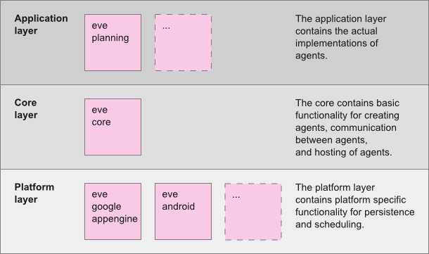

# Overview

Eve has libraries available for Java. The Eve libraries can be added to an existing Java project, 
and require almost no configuration (see [this tutorial](java_gettingstarted.html)).
Agents are regular Java classes decorated with some annotations. 
The agents are hosted via a regular web servlet.

## Libraries {#libraries}

The Java libraries are spread over three different layers:

- **Core Layer**  
  There is one core library, named *eve-core.jar*. This is the basis of Eve, 
  and is always required.
  It contains abstract base classes for agents and persistency, 
  offers functionality for communication between agents, 
  and contains a number of ready-made servlets to host the agents. 
  The core is independent from the deployment platform.

- **Platform Layer**  
  The platform layer contains platform specific functionality for persistence
  and scheduling. The platform libraries offer an interface to the agents for 
  reading/writing data, and for scheduling tasks. 
  There are platform libraries for a regular java web application, for running
  an application on Google App Engine. In the future, libraries for 
  Windows Azure and Amazon will be added.
  To deploy an application on a another platform, all is needed is to swap 
  the used platform library.

- **Application Layer**  
  The application layer contains the actual implementations of agents.
  The agents are independent from the deployment platform.
  Eve will come with libraries containing agents that acting on the area of planning, 
  calendaring, and a number of agent that wrap existing web services. 
  

The image below shows a schematic overview of the layers and libraries. 

*Remark: Only the libraries eve-core and eve-google-appengine are 
ready for download at this moment. More libraries will follow soon.*

The Java libraries can be downloaded at 
[https://github.com/almende/eve/tree/master/java/bin](https://github.com/almende/eve/tree/master/java/bin).

## Agents {#agents}

An Eve agent is just a regular Java class, which inherits from the base class Agent.
By default, public methods in the Agent will be available via JSON-RPC.
The methods must have annotations to define parameter names,
as the communication protocol uses named parameters, which are not supported natively by Java. 
The methods can optionally have annotations to define access rights. 

<!-- TODO: more text on agents -->

## Servlets {#servlets}

In Java, agents are hosted via a web servlet. 
Eve comes with two ready-made servlets: a SingleAgentServlet and a MultiAgentServlet.
These servlets are located in the eve-core.jar library. 
Furthermore, one can create its own custom servlet when needed.

- The *SingleAgentServlet* will host a single agent which can be accessed 
directly via the servlet url (http://server/servlet).

- The *MultiAgentServlet* can host multiple agent classes and multiple instances
of each agent class. To adress an instance of an agent, the url
is built up with the servlet path, agent class name, and id of the agent 
(http://server/servlet/agentclass/agentid).

<!-- TODO: more text on servlets
The MultiAgentServlet configuration needs two initialization parameters: 
*agents* and *context*.

- The *agents* parameter contains a list with the agent classes which will be
hosted by the servlet. The classes must be separated by a semicolon.
Eve comes with a number of example agents, such as the CalcAgent and the EchoAgent,
so you can use these to test if your application works. 

- The *context* parameter specifies the context that will be available for the 
agents to read and write persistent data.
-->

